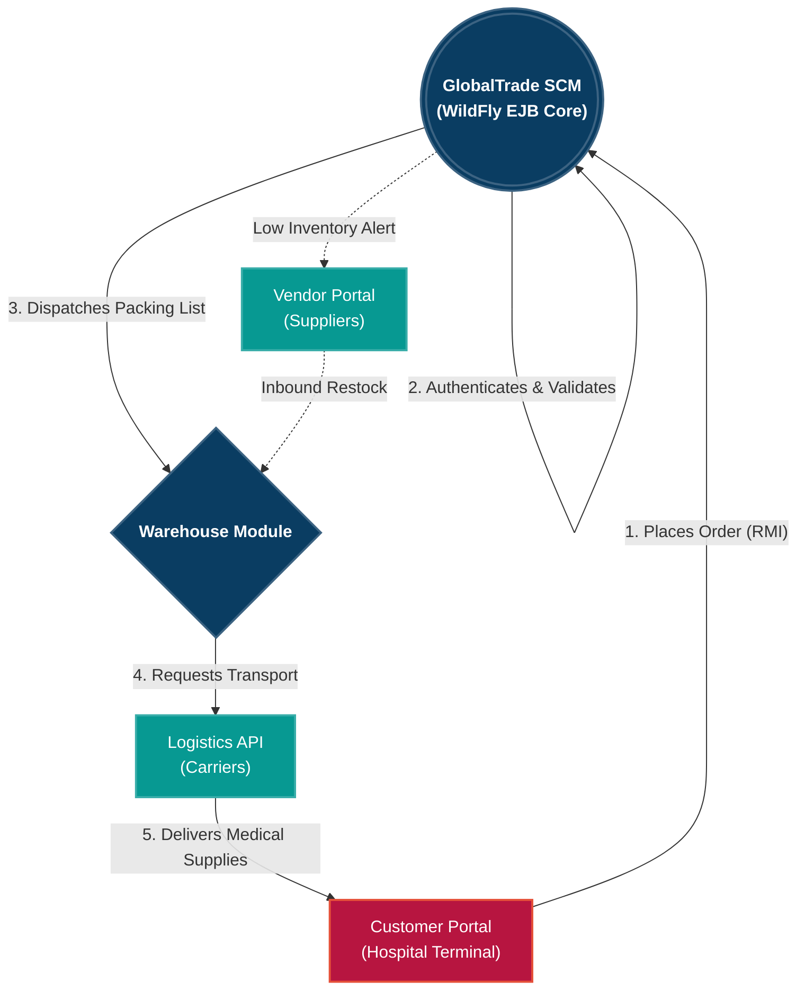

# GlobalTrade SCM Platform

An enterprise-grade Supply Chain Management (SCM) simulation platform built on **Java EE (Jakarta EE)** technologies. The platform orchestrates complex logistics, inventory management, and B2B vendor transactions using a robust, decoupled multi-tier architecture.

---

## 🏛️ Architecture & Tech Stack

The system is designed with a strict multi-module Maven architecture, decoupling the client, core data, and business logic into independent deployment artifacts.

* **Application Server:** WildFly 40.0
* **Persistence:** Hibernate / JPA 3.2
* **Database:** PostgreSQL
* **Business Logic:** Enterprise JavaBeans (EJB 3.x / 4.0)
* **Client Protocol:** EJB Remote Method Invocation (RMI)

### Module Breakdown
* `globaltrade-core`: Shared JPA Entities (`Order`, `Customer`, `Inventory`, etc.) and exceptions.
* `globaltrade-ejb`: The backend brain. Contains Stateless Session Beans (`OrderManagerBean`, `InventoryManagerBean`) and asynchronous timers.
* `globaltrade-client`: A standalone Java terminal application that securely connects to the WildFly server over JNDI and RMI to act as a B2B consumer (e.g., Hospital Terminal).
* `globaltrade-web`: A placeholder module for future frontend integrations (React/Angular/JSP).
* `globaltrade-ear`: The Enterprise Archive that bundles the EJB and Core components for deployment to WildFly.

---

## 🚀 Key Features

### 1. Interactive Client Terminal
* **Live Network Ordering:** A standalone Java console application that securely authenticates as a B2B partner (Hospital) and connects over RMI.
* **Dynamic Inventory Fetching:** Real-time querying of PostgreSQL inventory stocks.
* **Order History Tracking:** Pulls historical, lazy-loaded JPA entities safely serialized across the network.

### 2. Enterprise-Grade Security
* **Role-Based Access Control (RBAC):** EJB `@RolesAllowed("CUSTOMER")` annotations ensure only authorized partners can execute transactions.
* **Strict Transaction Validation:** Intercepts malicious inputs natively at the EJB boundary before database insertion, rejecting invalid product requests and preventing unauthorized access to other customers' orders.
* **Audit Logging:** Every critical method invocation is tracked via custom `@Interceptors(AuditLoggingInterceptor.class)`, creating immutable logs of system access.

### 3. Supply Chain Flow (Architecture Diagram)
The platform is designed to orchestrate the complete lifecycle of a medical supply chain. Below is the architectural vision for the system:



### Planned (Roadmap)
* **Warehouse Integration:** Automated backend actors to process `PENDING` orders, deduct stock, and generate packing lists.
* **Vendor & Customs Portals:** Integration points for 3rd party factories and border officials to clear inbound shipments.
* **Web UI:** Exposing the EJBs as REST APIs using JAX-RS for a modern frontend.

---

## 🛠️ Setup & Deployment

### Prerequisites
1. **Java 17+**
2. **Maven 3.8+**
3. **WildFly 40+** installed locally.
4. **PostgreSQL** installed locally (Port 5432) with a database named `globaltrade_db`.

### 1. Database Configuration
1. Install the PostgreSQL JDBC driver as a module in your WildFly instance.
2. Edit your `standalone/configuration/standalone.xml` to define the Datasource:
```xml
<datasource jndi-name="java:/GlobalTradeDS" pool-name="GlobalTradeDS" enabled="true" use-java-context="true">
    <connection-url>jdbc:postgresql://localhost:5432/globaltrade_db</connection-url>
    <driver>postgresql</driver>
    <security user-name="<YOUR_DB_USER>" password="<YOUR_DB_PASSWORD>"/>
</datasource>
```
*(Note: WildFly requires the single-tag attribute syntax for security credentials).*

### 2. Build and Deploy
Execute the Maven build from the root directory to compile all modules and generate the EAR.
```bash
mvn clean install
```
Deploy the resulting `globaltrade-ear.ear` to your WildFly server. The `import.sql` script will automatically seed the PostgreSQL database with a dummy hospital account and medical inventory upon successful boot.

### 3. Run the Client Simulation
With the server running, execute `com.globaltrade.client.SimulationEngine` via your IDE to launch the Interactive Hospital Terminal and begin placing orders over the network.
