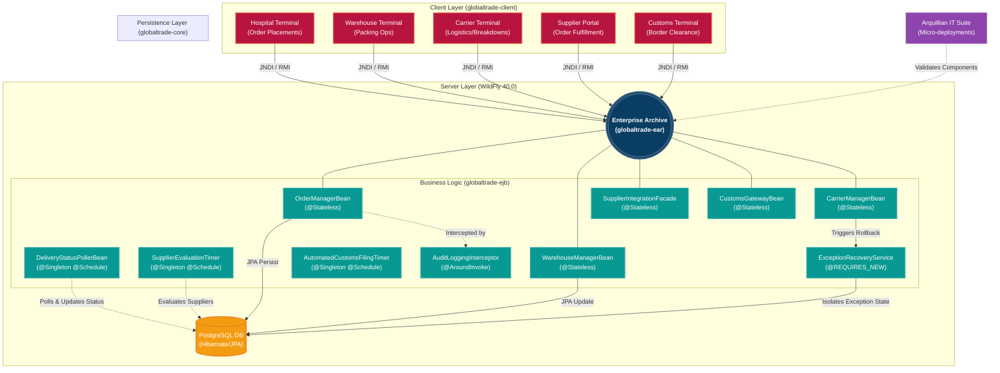

# GlobalTrade SCM Platform

An enterprise-grade Supply Chain Management (SCM) simulation platform built on **Java EE (Jakarta EE)** technologies. The platform orchestrates complex logistics, inventory management, and B2B vendor transactions using a robust, decoupled multi-tier architecture.

---

## Table of Contents

- [Architecture & Tech Stack](#%EF%B8%8F-architecture--tech-stack)
  - [Module Breakdown](#module-breakdown)
- [Key Features](#-key-features)
  - [1. Interactive Client Terminals](#1-interactive-client-terminals)
  - [2. Enterprise-Grade Security](#2-enterprise-grade-security)
  - [3. Advanced EJB Capabilities](#3-advanced-ejb-capabilities)
  - [4. Supply Chain Flow (Architecture Diagram)](#4-supply-chain-flow-architecture-diagram)
  - [Planned (Roadmap)](#planned-roadmap)
- [Setup & Deployment](#%EF%B8%8F-setup--deployment)
  - [Prerequisites](#prerequisites)
  - [1. Database Configuration](#1-database-configuration)
  - [2. WildFly User Setup](#2-wildfly-user-setup)
  - [3. Build and Deploy](#3-build-and-deploy)
  - [4. Run the Client Simulation](#4-run-the-client-simulation)

---

## 🏛️ Architecture & Tech Stack

The system is designed with a strict multi-module Maven architecture, decoupling the client, core data, and business logic into independent deployment artifacts.

- **Application Server:** WildFly 40.0
- **Persistence:** Hibernate / JPA 3.2
- **Database:** PostgreSQL
- **Business Logic:** Enterprise JavaBeans (EJB 3.x / 4.0)
- **Client Protocol:** EJB Remote Method Invocation (RMI)

### Module Breakdown

| Module               | Role           | Description                                                     |
| -------------------- | -------------- | --------------------------------------------------------------- |
| `globaltrade-core`   | Shared Data    | JPA Entities (`Order`, `Customer`) and global exceptions.       |
| `globaltrade-ejb`    | Business Logic | Stateless Session Beans and asynchronous timers (`@Schedule`).  |
| `globaltrade-client` | Remote UI      | Client simulation engine featuring an Interactive CLI and an Embedded Web Portal UI. |
| `globaltrade-ear`    | Deployment     | Enterprise Archive bundling EJB and Core for WildFly.           |
| `globaltrade-web`    | Frontend       | Internal Global Logistics Engine Web Dashboard (JSP/Tailwind).  |

---

## 🚀 Key Features

### 1. Interactive Client Terminals

| Terminal               | Purpose                                                                    | Commands                                     |
| ---------------------- | -------------------------------------------------------------------------- | -------------------------------------------- |
| **Hospital Portal**    | Secure B2B client for placing medical orders                               | `order`, `history`, `list`                   |
| **Warehouse Ops**      | Internal tool for staff to pack shipments and reconcile stock              | `pending`, `pack`, `reconcile`, `wms-outage` |
| **Carrier Logistics**  | Universal mobile tool for drivers managing Inbound and Outbound deliveries | `manifest`, `pickup`, `deliver`, `breakdown` |
| **Supplier Portal**    | Secure B2B client for vendors to fulfill restock orders                    | `orders`, `fulfill`, `evaluations`           |
| **Government Customs** | Secure portal for border clearance                                         | `list`, `approve`, `reject`                  |

#### Terminal Preview Example (Carrier)

```text
=========================================
         CARRIER LOGISTICS TERMINAL        
=========================================
 Commands:
  1. 'manifest' - View all packages ready for pickup (Inbound & Outbound)
  2. 'pickup <TrackingNumber>' - Mark package as IN_TRANSIT
  3. 'deliver <TrackingNumber>' - Mark package DELIVERED
  4. 'breakdown <TrackingNumber>' - Trigger vehicle failure
  5. 'exit' - Close terminal

Enter command: breakdown TRK-OUT-001

[SERVER] Transmitting breakdown alert...
  -> [EXCEPTION CAUGHT] CRITICAL: Truck breakdown detected for Tracking Number TRK-OUT-001. Executing recovery protocols.
  -> [RECOVERY] Order has been re-routed and marked DELAYED_TRANSIT_ISSUE by backup system.
```

### 2. Enterprise-Grade Security

- **Role-Based Access Control (RBAC):** EJB `@RolesAllowed` annotations restrict access per-actor (CUSTOMER, WAREHOUSE_STAFF, CARRIER).
- **Strict Transaction Validation:** Intercepts malicious inputs natively at the EJB boundary before database insertion, rejecting invalid product requests and preventing unauthorized access to other customers' orders.
- **Audit Logging:** Every critical method invocation is tracked via custom `@Interceptors(AuditLoggingInterceptor.class)`, creating immutable logs of system access.

### 3. Advanced EJB Capabilities

- **External WMS Integration:** A mocked Warehouse Management System using `@Singleton` and `ConcurrentHashMap` to stage cycle counts. An automated `@Schedule` timer asynchronously fetches these counts, reconciles the database, and dynamically triggers vendor restock orders if inventory dips below defined thresholds.
- **Supplier Evaluation Engine:** An automated `@Schedule` singleton bean (`SupplierEvaluationTimerBean`) that evaluates vendor punctuality, defect rates, and customs compliance, automatically suspending vendors who fall below the required performance threshold.
- **Automated Supply Chain Timers:** An asynchronous `@Schedule` singleton bean (`DeliveryStatusPollerBean`) that continually advances packed orders to a shipped status and dynamically polls for delivery confirmations.
- **Transaction Exception Recovery:** Simulates real-world supply chain failures (e.g., truck breakdowns, WMS API outages). The system safely catches custom `rollback=true` exceptions, suspends the doomed transaction, and handles recovery gracefully.
- **Arquillian Integration Testing:** Fully automated test suite that spins up a micro-deployment inside WildFly to rigorously validate EJB security wrappers, transaction boundaries, and database constraints.

### 4. Supply Chain Flow (Architecture Diagram)

The platform is designed to orchestrate the complete lifecycle of a medical supply chain. Below is the architectural vision for the system:



---

## 🛠️ Setup & Deployment

### Prerequisites

1. **Java 17+**
2. **Maven 3.8+**
3. **WildFly 40+** installed locally.
4. **PostgreSQL** installed locally (Port 5432) with a database named `globaltrade_db`.

### 1. Database Configuration

1. Install the PostgreSQL JDBC driver as a module in your WildFly instance.
2. Edit your `standalone/configuration/standalone.xml` to define the Datasource:

```xml
<datasource jndi-name="java:/GlobalTradeDS" pool-name="GlobalTradeDS" enabled="true" use-java-context="true">
    <connection-url>jdbc:postgresql://localhost:5432/globaltrade_db</connection-url>
    <driver>postgresql</driver>
    <security user-name="<YOUR_DB_USER>" password="<YOUR_DB_PASSWORD>"/>
</datasource>
```

*(Note: WildFly requires the single-tag attribute syntax for security credentials).*

### 2. WildFly User Setup

Before running the interactive client terminals, you must register the authorized application users and their EJB roles in WildFly. Run the `add-user` script from your WildFly `bin` directory:

```bash
./add-user.sh -a -u "<USERNAME>" -p "<PASSWORD>" -g "<ROLE_NAME>"
```

### 3. Build and Deploy

Execute the Maven build from the root directory to compile all modules and generate the EAR.

```bash
mvn clean install
```

Deploy the resulting `globaltrade-ear.ear` to your WildFly server. The `import.sql` script will automatically seed the PostgreSQL database with a dummy hospital account and medical inventory upon successful boot.

### 4. Run the Client Simulation

With the server running, you can access the two main interfaces:

**Internal Web Dashboard:**
Open your browser to `http://localhost:8080/globaltrade` to view the beautiful, real-time Global Logistics Engine dashboard.

**Client Web Portal & CLI Simulation:**
Execute `com.globaltrade.client.SimulationEngine` via your IDE. You can choose to launch individual CLI terminals (Options 1-5) to interact securely over JNDI/RMI, or select Option 7 to launch the fully-fledged embedded **Client Web Portal** on `http://localhost:8081`!
