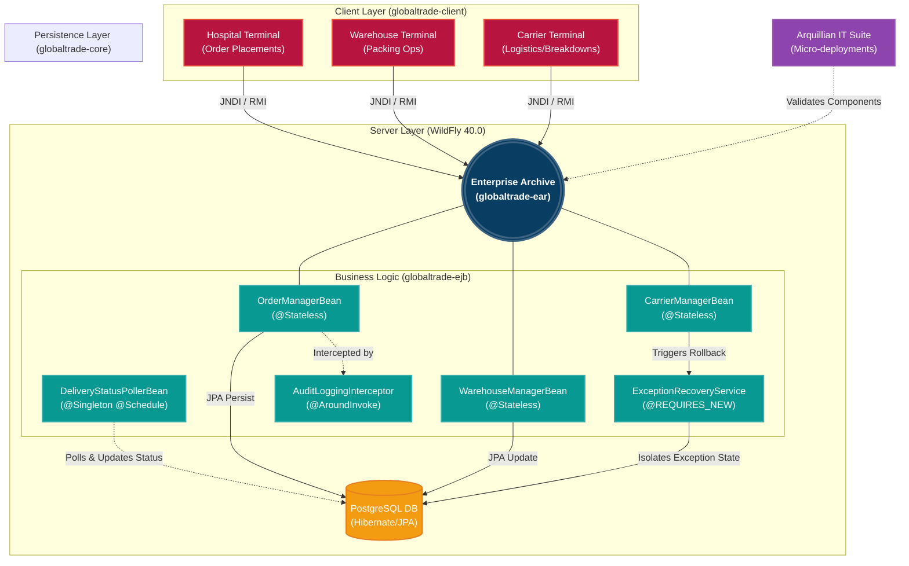

# GlobalTrade SCM Platform

An enterprise-grade Supply Chain Management (SCM) simulation platform built on **Java EE (Jakarta EE)** technologies. The platform orchestrates complex logistics, inventory management, and B2B vendor transactions using a robust, decoupled multi-tier architecture.

---

## Table of Contents
- [Architecture & Tech Stack](#%EF%B8%8F-architecture--tech-stack)
  - [Module Breakdown](#module-breakdown)
- [Key Features](#-key-features)
  - [1. Interactive Client Terminals](#1-interactive-client-terminals)
  - [2. Enterprise-Grade Security](#2-enterprise-grade-security)
  - [3. Advanced EJB Capabilities](#3-advanced-ejb-capabilities)
  - [4. Supply Chain Flow (Architecture Diagram)](#4-supply-chain-flow-architecture-diagram)
  - [Planned (Roadmap)](#planned-roadmap)
- [Setup & Deployment](#%EF%B8%8F-setup--deployment)
  - [Prerequisites](#prerequisites)
  - [1. Database Configuration](#1-database-configuration)
  - [2. WildFly User Setup](#2-wildfly-user-setup)
  - [3. Build and Deploy](#3-build-and-deploy)
  - [4. Run the Client Simulation](#4-run-the-client-simulation)

---
## 🏛️ Architecture & Tech Stack

The system is designed with a strict multi-module Maven architecture, decoupling the client, core data, and business logic into independent deployment artifacts.

* **Application Server:** WildFly 40.0
* **Persistence:** Hibernate / JPA 3.2
* **Database:** PostgreSQL
* **Business Logic:** Enterprise JavaBeans (EJB 3.x / 4.0)
* **Client Protocol:** EJB Remote Method Invocation (RMI)

### Module Breakdown
| Module | Role | Description |
| :--- | :--- | :--- |
| `globaltrade-core` | Shared Data | JPA Entities (`Order`, `Customer`) and global exceptions. |
| `globaltrade-ejb` | Business Logic | Stateless Session Beans and asynchronous timers (`@Schedule`). |
| `globaltrade-client`| Remote UI | Standalone Java terminal connecting securely over JNDI and RMI. |
| `globaltrade-ear` | Deployment | Enterprise Archive bundling EJB and Core for WildFly. |
| `globaltrade-web` | Frontend | Placeholder for future React/JSP integrations. |

---

## 🚀 Key Features

### 1. Interactive Client Terminals

| Terminal | Purpose | Commands |
| :--- | :--- | :--- |
| **Hospital Portal** | Secure B2B client for placing medical orders | `order`, `history` |
| **Warehouse Ops** | Internal tool for staff to pack shipments | `pending`, `pack` |
| **Carrier Logistics** | Mobile tool for drivers to manage deliveries | `manifest`, `deliver`, `breakdown` |

#### Terminal Preview Example (Carrier)
```text
=========================================
         CARRIER LOGISTICS TERMINAL        
=========================================
 Commands:
  1. 'manifest' - View all shipped packages on truck
  2. 'deliver <OrderId>' - Mark package delivered
  3. 'breakdown <OrderId>' - Trigger vehicle failure

Enter command: breakdown 2

[SERVER] Transmitting breakdown alert...
  -> [EXCEPTION CAUGHT] CRITICAL: Truck breakdown detected for Order ID 2. Executing recovery protocols.
  -> [RECOVERY] Order has been re-routed and marked DELAYED_TRANSIT_ISSUE by backup system.
```

### 2. Enterprise-Grade Security
* **Role-Based Access Control (RBAC):** EJB `@RolesAllowed` annotations restrict access per-actor (CUSTOMER, WAREHOUSE_STAFF, CARRIER).
* **Strict Transaction Validation:** Intercepts malicious inputs natively at the EJB boundary before database insertion, rejecting invalid product requests and preventing unauthorized access to other customers' orders.
* **Audit Logging:** Every critical method invocation is tracked via custom `@Interceptors(AuditLoggingInterceptor.class)`, creating immutable logs of system access.

### 3. Advanced EJB Capabilities
* **Automated Supply Chain Timers:** An asynchronous `@Schedule` singleton bean (`DeliveryStatusPollerBean`) that continually advances packed orders to a shipped status and dynamically polls for delivery confirmations.
* **Transaction Exception Recovery:** Simulates real-world supply chain failures (e.g., truck breakdowns). The system safely catches custom `rollback=true` exceptions, suspends the doomed transaction, and uses a `@TransactionAttribute(REQUIRES_NEW)` recovery service to securely isolate the failure into a delayed state without crashing.
* **Arquillian Integration Testing:** Fully automated test suite that spins up a micro-deployment inside WildFly to rigorously validate EJB security wrappers, transaction boundaries, and database constraints.

### 4. Supply Chain Flow (Architecture Diagram)
The platform is designed to orchestrate the complete lifecycle of a medical supply chain. Below is the architectural vision for the system:



### Planned (Roadmap)
* **Customs Integration:** Integration points for border officials to clear inbound international shipments.
* **Web UI:** Exposing the EJBs as REST APIs using JAX-RS for a modern frontend.

---

## 🛠️ Setup & Deployment

### Prerequisites
1. **Java 17+**
2. **Maven 3.8+**
3. **WildFly 40+** installed locally.
4. **PostgreSQL** installed locally (Port 5432) with a database named `globaltrade_db`.

### 1. Database Configuration
1. Install the PostgreSQL JDBC driver as a module in your WildFly instance.
2. Edit your `standalone/configuration/standalone.xml` to define the Datasource:
```xml
<datasource jndi-name="java:/GlobalTradeDS" pool-name="GlobalTradeDS" enabled="true" use-java-context="true">
    <connection-url>jdbc:postgresql://localhost:5432/globaltrade_db</connection-url>
    <driver>postgresql</driver>
    <security user-name="<YOUR_DB_USER>" password="<YOUR_DB_PASSWORD>"/>
</datasource>
```
*(Note: WildFly requires the single-tag attribute syntax for security credentials).*

### 2. WildFly User Setup
Before running the interactive client terminals, you must register the authorized application users and their EJB roles in WildFly. Run the `add-user` script from your WildFly `bin` directory:
```bash
./add-user.sh -a -u "<USERNAME>" -p "<PASSWORD>" -g "<ROLE_NAME>"
```

### 3. Build and Deploy
Execute the Maven build from the root directory to compile all modules and generate the EAR.
```bash
mvn clean install
```
Deploy the resulting `globaltrade-ear.ear` to your WildFly server. The `import.sql` script will automatically seed the PostgreSQL database with a dummy hospital account and medical inventory upon successful boot.

### 4. Run the Client Simulation
With the server running, execute `com.globaltrade.client.SimulationEngine` via your IDE to launch the Interactive Hospital Terminal and begin placing orders over the network.
