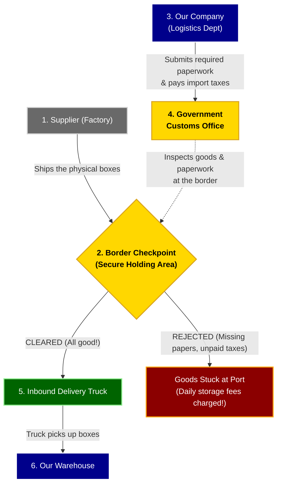

# Customs & Government Clearance Process

When buying goods from another country, they can't just be driven straight to our warehouse. Every international shipment must stop at the border (a seaport, airport, or land crossing) so the government can check it.

This process is called **Customs Clearance**. The government has two main goals:
1. **Security:** Making sure no illegal or dangerous items are brought into the country.
2. **Taxes (Duties):** Collecting a tax on imported goods.

## The Step-by-Step Process

---

# EJB Implementation Plan: Customs Clearance Module

To implement this complex process within our Java EE architecture while hitting all the critical rubric requirements (Timer Services, Interceptors, Security, Exception Handling), we will break the development into isolated phases.

## Phase 1: Data Layer (Entities & Enums)
Before writing business logic, we need the database structures to hold the customs data and track the state of the shipment.
*   **Create `ShipmentStatus` Enum:** Add `PENDING_CUSTOMS`, `AT_BORDER`, `CLEARED`, `REJECTED`.
*   **Create `CustomsDeclaration` Entity:** An entity linked to a shipment containing `hsCode`, `taxPaid`, `brokerName`, and `submissionDate`.
*   **Create `CustomsAuditLog` Entity:** An immutable table specifically for our interceptor to log every interaction with the government.

## Phase 2: Core Business Logic & Security (EJB & RMI)
We will build the gateway that external Customs Brokers (or mock government agents) will use to communicate with our system over RMI.
*   **Create `CustomsGatewayRemote` & `CustomsGatewayLocal`:** Explicitly define the interfaces.
*   **Create `CustomsGatewayBean` (`@Stateless`):** The core EJB. 
*   **Add Security:** Protect all remote methods with `@RolesAllowed("CUSTOMS_OFFICIAL")` to ensure strict JNDI client authentication.

## Phase 3: The Audit Trail (EJB Interceptor)
International trade requires permanent paper trails. We will use an interceptor to guarantee that every clearance decision is audited without cluttering the business logic.
*   **Create `CustomsComplianceInterceptor`:** This class will intercept calls to the `CustomsGatewayBean`.
*   **Implementation:** Before the bean processes a clearance or rejection, the interceptor will automatically write a record to the `CustomsAuditLog` entity.

## Phase 4: Business Resilience (Exception Handling)
When customs rejects a shipment, we must ensure our database doesn't accidentally save partial updates (e.g., deducting warehouse space for a truck that isn't coming).
*   **Create `CustomsClearanceRejectedException`:** A custom exception annotated with `@ApplicationException(rollback=true)`.
*   **Implementation:** If the `CustomsGatewayBean` detects missing documents or unpaid taxes, it throws this exception, forcing the EJB container to cleanly rollback the transaction.

## Phase 5: Automated Monitoring (EJB Timer Service)
If a shipment is stuck at the border, the port charges daily demurrage fees. Our system needs to actively monitor for this.
*   **Create `CustomsMonitorTimerBean`:** A `@Singleton` or `@Stateless` bean.
*   **Implementation:** Use the `@Schedule` annotation (e.g., every day at midnight, or every 5 minutes for testing). The timer will query the database for any shipment in the `AT_BORDER` state for more than 48 hours and log a critical alert.

## Phase 6: End-of-Project Arquillian Testing
Following our strict project rules, testing will be done exclusively using Arquillian inside the EJB container.
*   **Test Data Setup:** Explicitly construct and `persist()` Orders, Shipments, and Declarations in the test setup. Ensure all `@Column(nullable=false)` fields are populated.
*   **Security Testing:** Use the "Wrapper Bean" pattern. Create a top-level `@Stateless` bean annotated with `@RunAs("CUSTOMS_OFFICIAL")` and `@PermitAll` to securely invoke our `CustomsGatewayBean` without triggering an anonymous `EJBAccessException`.
*   **Exception Testing:** Verify that throwing `CustomsClearanceRejectedException` correctly aborts the transaction and leaves the database state unmodified.
*   **ShrinkWrap:** Explicitly add our custom exceptions to the `.addClasses()` list in the micro-deployment to prevent `ClassNotFoundException` crashes over RMI.

## Phase 7: Automated Customs Filing Bridge (EJB Timer Service)
Instead of forcing human brokers or government officials to manually submit paperwork, our system needs an automated broker to do the heavy lifting in the background.
*   **Create `AutomatedCustomsFilingTimerBean`:** A `@Singleton` timer service scheduled to run periodically.
*   **Implementation:** It queries the database for any `Shipment` in the `READY_FOR_EXPORT` state (set by the Supplier during fulfillment) and automatically invokes the `CustomsGatewayBean.submitDeclaration()` method on their behalf.
*   **State Transition:** Once the paperwork is successfully filed, the shipment seamlessly transitions to `AT_BORDER_PENDING_CLEARANCE` so it appears immediately in the Customs Terminal for human review.
*   **Security Context:** Because EJB background timers have no user session, the timer bean itself is annotated with `@RunAs("CUSTOMS_OFFICIAL")` and `@PermitAll` to securely invoke the protected gateway.

## Phase 8: Exception Recovery Strategy (`REQUIRES_NEW`)
If the automated filing fails (e.g., rejected paperwork) and the main EJB throws `CustomsClearanceRejectedException`, the container rolls back the entire transaction. This means we can't update the shipment status to show it failed within that same transaction!
*   **Create `ExceptionRecoveryService`:** A separate `@Stateless` bean specifically for handling recovery actions.
*   **Implementation:** The recovery method is annotated with `@TransactionAttribute(TransactionAttributeType.REQUIRES_NEW)`. This suspends the failing parent transaction and starts a brand new, isolated transaction to safely update the shipment status to `CUSTOMS_PAPERWORK_REJECTED` and `em.merge()` it.

## Phase 9: Government Terminal & RMI Safety
We need a CLI interface for the Government Officials to review the automated paperwork and issue final clearance decisions.
*   **Implement `CustomsActor` (Client):** Build the interactive CLI with commands to `list` pending shipments, `approve`, and `reject` them.
*   **EJB Read Safety:** Add a `getPendingClearanceShipments()` method to the EJB. Following strict RMI rules, annotate it with `@TransactionAttribute(TransactionAttributeType.SUPPORTS)` and use `LEFT JOIN FETCH` to ensure lazy-loaded relationships (like Vendor) don't crash the client with proxy serialization errors.
*   **Interceptor Tuning:** Bypass the `CustomsComplianceInterceptor` for read-only methods (like `list` and `ping`) to prevent `TransactionRequiredException` crashes when the interceptor attempts to persist an audit log outside of an active transaction.
