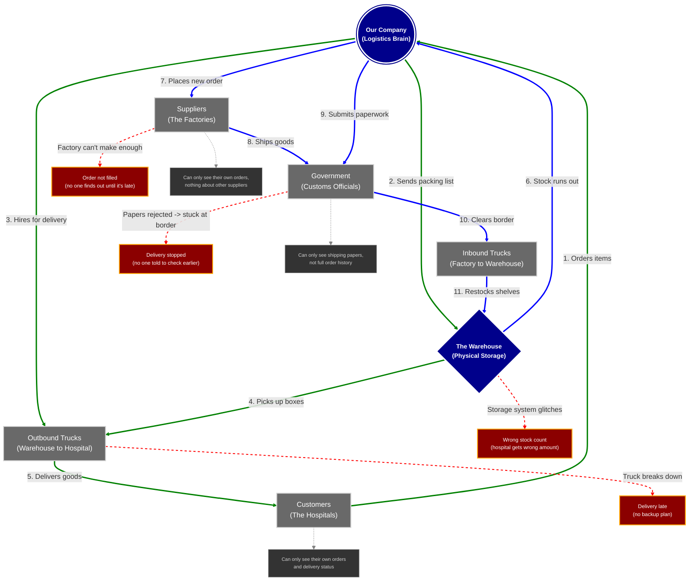

```mermaid
graph TD
    %% Styling
    classDef core fill:darkblue,stroke:white,stroke-width:3px,color:white,font-size:14px,font-weight:bold;
    classDef entity fill:dimgray,stroke:lightgray,stroke-width:2px,color:white;
    classDef problem fill:darkred,stroke:orange,stroke-width:2px,color:white,font-size:12px;
    classDef note fill:#333,stroke:gray,stroke-width:1px,color:lightgray,font-size:11px;

    %% 1. THE CENTER PIECES
    Company((("Our Company<br/>(Logistics Brain)"))):::core
    Warehouse{"The Warehouse<br/>(Physical Storage)"}:::core

    %% 2. THE PERIPHERAL ENTITIES
    Suppliers["Suppliers<br/>(The Factories)"]:::entity
    Customers["Customers<br/>(The Hospitals)"]:::entity
    Customs["Government<br/>(Customs Officials)"]:::entity
    InboundCarriers["Inbound Trucks<br/>(Factory to Warehouse)"]:::entity
    OutboundCarriers["Outbound Trucks<br/>(Warehouse to Hospital)"]:::entity

    %% 3. OUTBOUND LOGISTICS (Green Arrows - Indices 0-4)
    Customers -->|"1. Orders items"| Company
    Company -->|"2. Sends packing list"| Warehouse
    Company -->|"3. Hires for delivery"| OutboundCarriers
    Warehouse -->|"4. Picks up boxes"| OutboundCarriers
    OutboundCarriers -->|"5. Delivers goods"| Customers

    %% 4. INBOUND LOGISTICS (Blue Arrows - Indices 5-10)
    Warehouse -->|"6. Stock runs out"| Company
    Company -->|"7. Places new order"| Suppliers
    Suppliers -->|"8. Ships goods"| Customs
    Company -->|"9. Submits paperwork"| Customs
    Customs -->|"10. Clears border"| InboundCarriers
    InboundCarriers -->|"11. Restocks shelves"| Warehouse

    %% 5. WHAT GOES WRONG (Red Arrows - the "oh no" paths)
    Customs -->|"Papers rejected -> stuck at border"| Problem1["Delivery stopped<br/>(no one told to check earlier)"]:::problem
    OutboundCarriers -->|"Truck breaks down"| Problem2["Delivery late<br/>(no backup plan)"]:::problem
    Suppliers -->|"Factory can't make enough"| Problem3["Order not filled<br/>(no one finds out until it's late)"]:::problem
    Warehouse -->|"Storage system glitches"| Problem4["Wrong stock count<br/>(hospital gets wrong amount)"]:::problem

    %% 6. WHO CAN SEE / TOUCH WHAT
    NoteSuppliers["Can only see their own orders,<br/>nothing about other suppliers"]:::note
    NoteCustoms["Can only see shipping papers,<br/>not full order history"]:::note
    NoteCustomers["Can only see their own orders<br/>and delivery status"]:::note
    Suppliers -.-> NoteSuppliers
    Customs -.-> NoteCustoms
    Customers -.-> NoteCustomers

    %% Apply Colors to Arrows
    linkStyle 0,1,2,3,4 stroke:green,stroke-width:3px;
    linkStyle 5,6,7,8,9,10 stroke:blue,stroke-width:3px;
    linkStyle 11,12,13,14 stroke:red,stroke-width:2px,stroke-dasharray: 5 5;
    linkStyle 15,16,17 stroke:gray,stroke-width:1px,stroke-dasharray: 2 2;
```
